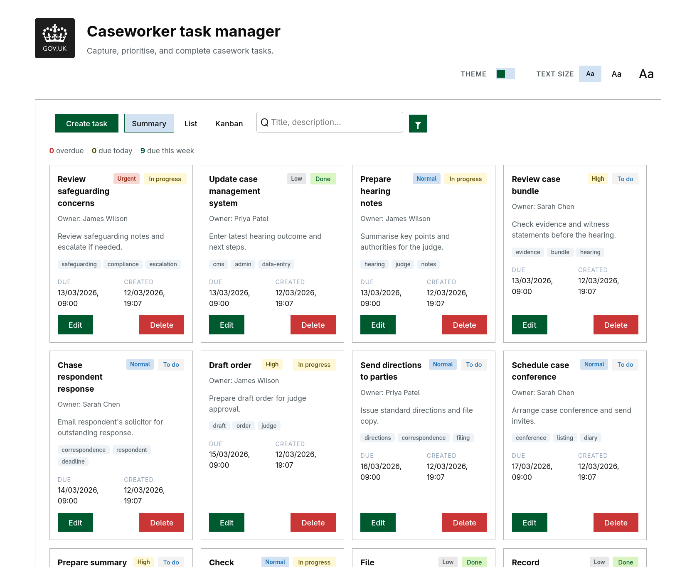
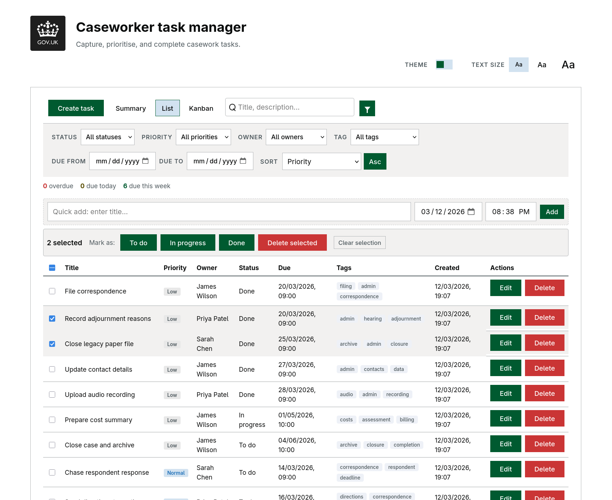
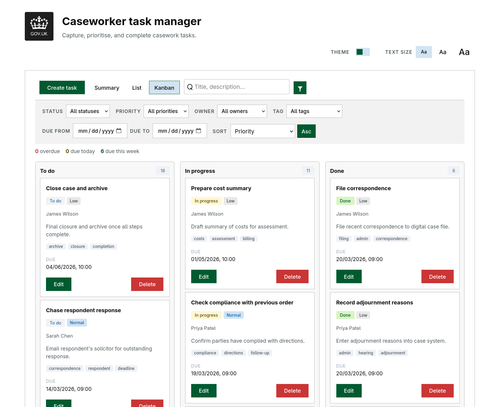
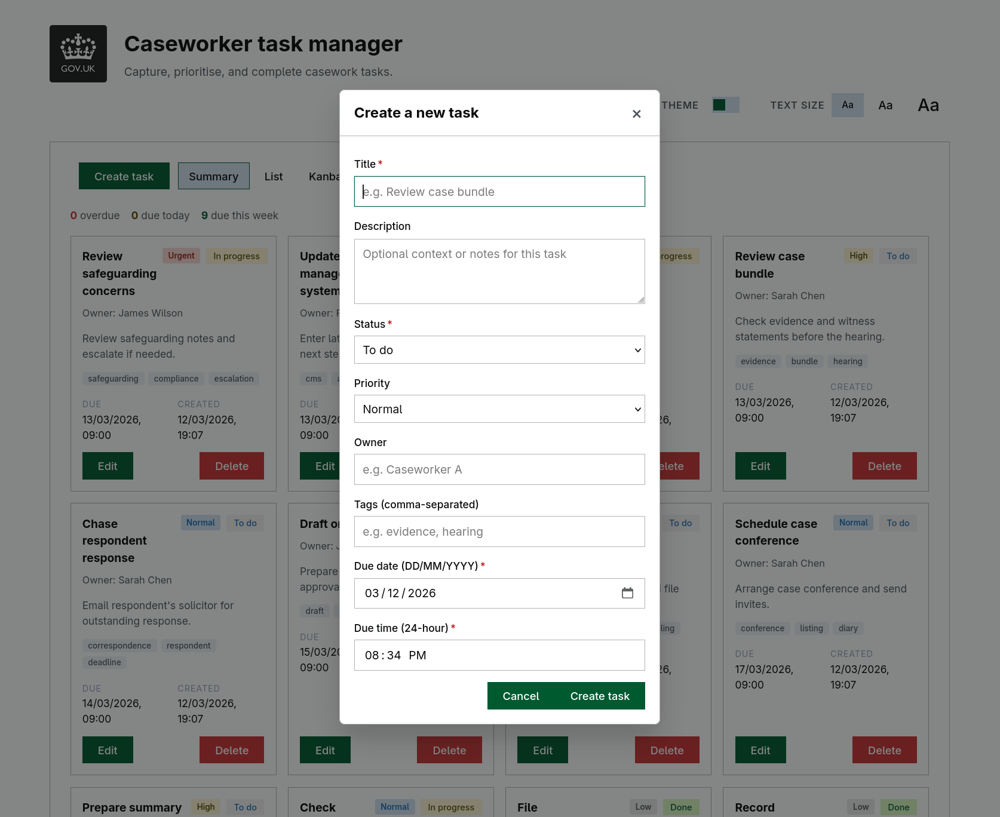
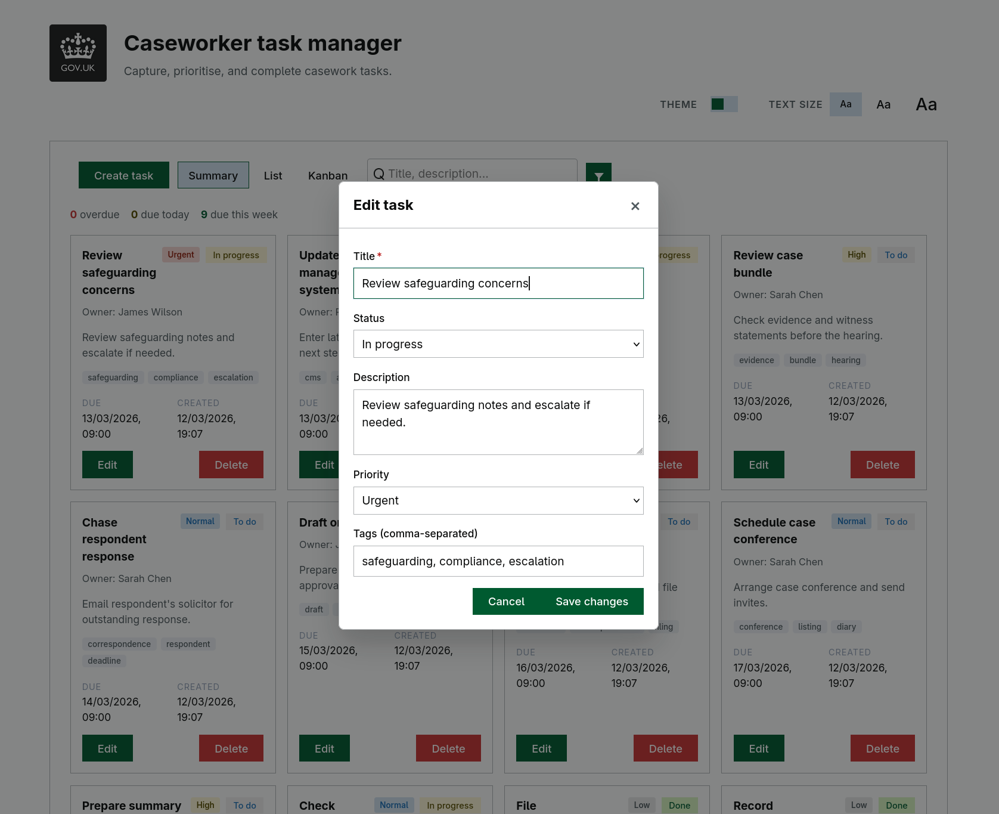
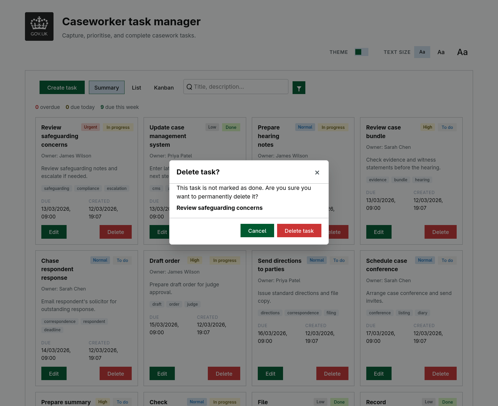
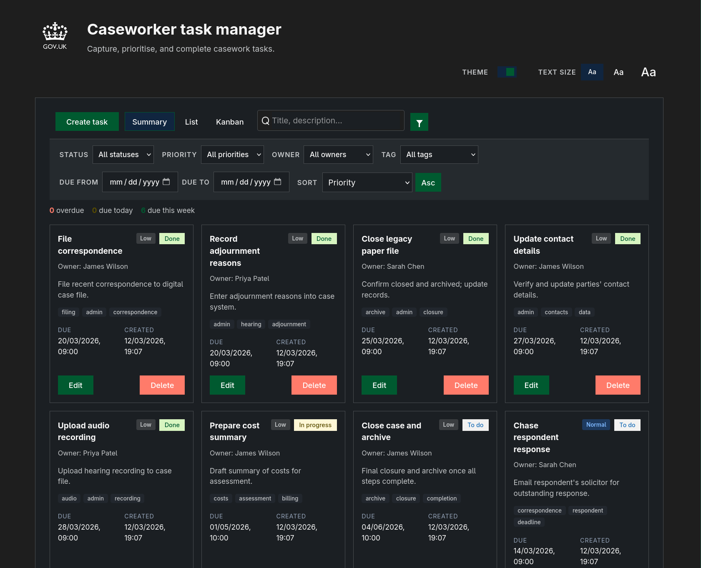

# DTS Caseworker Task Manager

[](VERSION)
[](https://github.com/RESTful-Otaku/gov-dts-submission/actions/workflows/web-build.yml)
[](https://github.com/RESTful-Otaku/gov-dts-submission/actions/workflows/mobile-builds.yml)
[](https://github.com/RESTful-Otaku/gov-dts-submission/actions/workflows/db-smoke-tests.yml)
[](https://github.com/RESTful-Otaku/gov-dts-submission/actions/workflows/android-release.yml)
[](https://github.com/RESTful-Otaku/gov-dts-submission/actions/workflows/ios-release.yml)

A full-stack task management app for caseworkers: create, view, update, and delete tasks via a web UI or mobile app. Backend in Go, frontend in Svelte, with SQLite, PostgreSQL, MariaDB or MongoDB.

| Platforms | Databases |
|-----------|-----------|
| Web · Android · iOS | SQLite · PostgreSQL · MariaDB · MongoDB |

---

## Quick start

### Interactive launcher (recommended)

```bash
./scripts/run.sh
```

This is the only command you need. It provides a guided menu for:
- **Run**: start the app (API + frontend) locally or via Docker, with SQLite/Postgres/MariaDB/MongoDB
- **Test**: run backend + frontend checks
- **Storybook**: run the component library
- **Build**: build Docker images
- **Mobile**: Android/iOS workflows

Once running:
- **Web UI**: `http://localhost:5173`
- **API**: `http://localhost:8080`

---

## Requirements

- **Go** (backend)
- **Bun** (frontend tooling) — install from [bun.sh](https://bun.sh)
- **Docker** (optional) — required for Docker runs and for local Postgres/MariaDB/MongoDB in “Local” mode
- **Android/iOS** (optional) — only if you use the Mobile menu

---

## Using `run.sh`

`run.sh` is a menu-driven launcher. The main options are:

```bash
./scripts/run.sh
```

### Run (API + UI)

- **Run → SQLite → Local**: quickest dev loop (no Docker required)
- **Run → Postgres/MariaDB/MongoDB → Local**: DB runs in Docker; API + UI run on your machine
- **Run → … → Docker**: full stack via Compose

Environment overrides (optional):
- **`HTTP_PORT`**: API port (default 8080)
- **`VITE_DEV_PORT`**: Vite dev server port (default 5173)
- **`STORYBOOK_PORT`**: Storybook port (default 6006)

### Test

- **Test** runs: backend tests + frontend check/test/build.

### Storybook

- **Storybook** builds and runs the component library locally.

### Mobile

Mobile workflows are available from the menu:
- **Mobile → Android → Local**: run the app on an emulator/device
- **Mobile → Android → Generate APK**: produce a debug APK (local SQLite mode)

The repo also contains helper scripts under `scripts/`, but `run.sh` is the supported entrypoint for day-to-day use.

## Appetize Demos
* 
* 

---

## Testing

Use the launcher:

```bash
./scripts/run.sh
# → Test
```

If you prefer running pieces manually (for debugging or CI parity), see `backend/API.md` and `frontend/package.json` scripts.

## Governance and security docs

- Contribution guidelines: `CONTRIBUTING.md`
- Security reporting policy: `SECURITY.md`
- Security architecture notes: `docs/security.md`
- Production hardening checklist: `docs/security.md` (Production hardening checklist section)
- Auth policy matrix and env profiles: `docs/auth-policy-matrix.md`
- Testing strategy and quality gates: `docs/testing-strategy.md`

### Mobile encryption configuration

- Native SQLite mode (`VITE_MOBILE_LOCAL_DB=true`) inlines `VITE_MOBILE_DB_SECRET` at **build** time for SQLCipher.
- **Local / scripts:** `source scripts/lib.sh` and run `gov_dts_export_vite_mobile_local_db_env` before `bun run build`, or set `VITE_MOBILE_DB_SECRET` yourself (override the default from `GOV_DTS_MOBILE_DB_SECRET_DEFAULT` in `scripts/lib.sh`).
- **API-backed native builds** (e.g. `scripts/run-android.sh` with `VITE_API_BASE=http://10.0.2.2:8081`): the app uses HTTP, not SQLCipher; `run-android.sh` sets `VITE_MOBILE_LOCAL_DB=false`, and if the flag is unset, a non-empty `VITE_API_BASE` at build time also selects remote API mode.
- **GitHub Actions (Android/iOS release + simulator artifact):** set repository secret **`VITE_MOBILE_DB_SECRET`** to a strong passphrase; if unset, workflows use a documented public dev placeholder and emit a notice.

## Web app

| Summary | List | Kanban |
|:-------:|:----:|:------:|
|  |  |  |

| Create | Edit | Delete | Dark mode |
|:------:|:----:|:------:|:---------:|
|  |  |  |  |

## Demos

**Web app**


**Mobile app**


